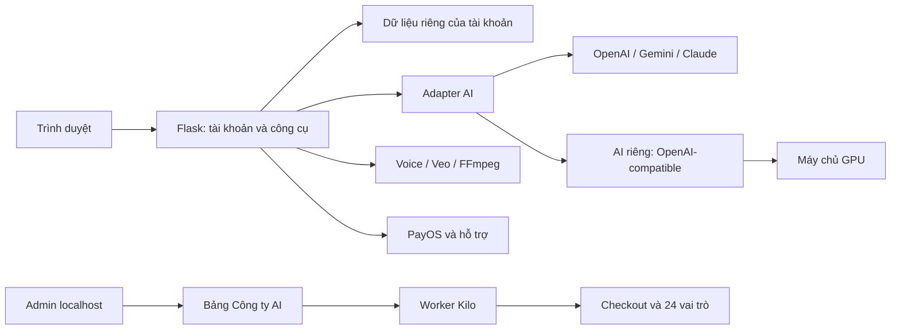

# Nâng cấp AI và máy chủ

## Cấu trúc



Model không tải vào Flask. Inference có thể ở máy khác; adapter gọi endpoint chủ website cấu hình. Đổi model/máy GPU không yêu cầu sửa giao diện.

| Phần | Mã nguồn |
|---|---|
| Giao diện | `templates/`, `static/` |
| Tài khoản/dữ liệu riêng | `studio_accounts.py` |
| Thanh toán | `studio_billing.py` |
| AI và luồng nội dung | `ai_providers.py`, `studio_ai.py` |
| AI riêng | `self_hosted_ai.py` |
| Văn bản/thư viện | `studio_workbench.py`, `work_templates.py` |
| Video/operation | `studio_pipeline.py`, `veo_jobs.py` |
| GitHub | `github_projects.py` |
| Công ty AI | `company_roster.py`, `studio_company.py`, `tools/company_*.py`, `.kilo/agents/` |
| Server | `app_entry.py`, `Dockerfile`, `compose.yaml` |
| Hợp đồng mở rộng | `contracts.py`; protocol provider/repository tương lai |

Pipeline voice V4 được giữ trong `AI_Video_Studio_V7_5_Backend_V4Voice.py`. Lớp tài khoản khởi tạo handler riêng theo thư mục user để giữ chức năng cũ; có thể chuyển dần sang service độc lập.

## Nối AI riêng

Server cần tương thích:

```text
GET  <BASE_URL>/models
POST <BASE_URL>/chat/completions
```

Gửi `model`, `messages` system/user, `stream=false`; đọc `choices[0].message.content`. `SELF_HOSTED_MAX_TOKENS` đặt ngân sách output (mặc định 8000, từ 1 đến 32768), chọn theo context/output thực tế của model. Model cần có trong `/models`.

1. Triển khai inference theo tài liệu engine/model, ví dụ vLLM hoặc Ollama tương thích. Gói chưa cài model/GPU runtime.
2. Lấy **URL và ID model thực tế**.
3. Điền `.env`:

```env
SELF_HOSTED_BASE_URL=http://IP-RIENG-CUA-MAY-GPU:8000/v1
SELF_HOSTED_MODEL=ID-MODEL-THUC-TE
SELF_HOSTED_API_KEY=KEY-DO-BAN-CAU-HINH
SELF_HOSTED_MAX_TOKENS=8000
```

4. Restart web → **AI riêng / máy chủ GPU** → kiểm tra API → thử yêu cầu nhỏ.
5. Đo độ trễ, bộ nhớ, chất lượng trước khi chuyển khách. Cloud vẫn chọn được theo công việc.

Trên là chỗ điền, không phải server/model có sẵn. URL không nhận từ form khách. HTTP dùng loopback/mạng riêng; qua mạng công khai cần HTTPS/key.

Trong Docker, `127.0.0.1` là container; dùng IP/tên dịch vụ mà container truy cập được. Adapter hiện chỉ có **văn bản/chia cảnh**. Ảnh/speech/video/embedding riêng cần adapter theo giao thức cụ thể. Veo vẫn là dịch vụ Google.

## Kilo dùng AI riêng

Kilo có cấu hình credentials riêng. Mẫu `kilo.self-hosted.example.jsonc`:

- Ghép mục `provider` vào `kilo.jsonc`, giữ cấu hình hiện có.
- Thay `YOUR_MODEL_ID`, `limit.context`, `limit.output` theo model thật.
- Xuất `SELF_HOSTED_BASE_URL`/`SELF_HOSTED_API_KEY` trong terminal Kilo hoặc dùng màn hình provider. Kilo không tự đọc `.env` Flask.
- Chọn model đó; model cần tool calling và context đủ đọc repo.
- Thử nhiệm vụ nhỏ, xem diff/bằng chứng. Chat được chưa xác nhận khả năng tool/subagent.

## GPU 5090/6000

| GPU | VRAM điển hình | Cần đánh giá |
|---|---|---|
| GeForce RTX 5090 | 32 GB | Model/quantization/context/batch/concurrency |
| RTX 6000 Ada | 48 GB | VRAM, driver, engine và hỗ trợ model |
| RTX PRO 6000 Blackwell | 96 GB | Đúng bản workstation/server, bộ nhớ và chi phí |

“6000” có nhiều đời/dung lượng; xác định tên card đầy đủ trước khi mua. Chưa benchmark các card này, chưa cam kết tốc độ/số user. Trọng số, KV cache, context, quantization, concurrency đều ảnh hưởng VRAM.

Giữ web/inference/ổ dữ liệu độc lập. Đo tải thật trước khi mua; FFmpeg, lưu trữ, băng thông cũng có thể là điểm nghẽn.

## Dữ liệu/chuyển máy

`STUDIO_DATA_ROOT` trống thì dữ liệu ở thư mục dự án. Có thể đặt đường dẫn tuyệt đối:

```env
STUDIO_DATA_ROOT=/srv/ai-work-studio/data
```

```text
<data-root>/
  .accounts/
    accounts.sqlite3       # user, đơn, hạn mức, ticket, audit
    ...                    # session secret
    data/<user-id>/
      workbench.sqlite3
      v7_voice_output/
      studio_assets/
      studio_exports/
      veo_jobs/
  .ai-company/             # database, token bridge
```

Pipeline cũ ở root không tự chuyển cho user đăng ký đầu tiên. Sao lưu rồi nhập tài liệu/tải snapshot để dùng dữ liệu V8.0.

Chuyển máy: dừng web/worker → sao lưu **toàn bộ data-root**/`.env` ở nơi bảo mật → copy code → phục hồi → đặt data-root → kiểm tra tài khoản/thư viện/Pro/media. Dừng ghi khi copy SQLite để không sót WAL. Giữ session secret/APP_SECRET_KEY. Không đưa dữ liệu khách/`.env` lên repo công khai.

Brief/log/báo cáo worker ở `.ai-company/missions/` dưới checkout; sao lưu thêm nếu checkout và data-root khác nhau.

## Docker

Cài Docker Engine/Desktop + Compose, tạo `.env` từ mẫu:

```sh
docker compose up -d --build
docker compose logs --tail=100 web
```

Bind `127.0.0.1:5000`, `./runtime` mount `/data`. Sau khi đăng ký:

```sh
docker compose exec web python tools/manage_accounts.py --make-admin email-cua-ban@example.com
```

Đặt reverse proxy HTTPS, `COOKIE_SECURE=true`, `PUBLIC_BASE_URL=https://domain-cua-ban` rồi tạo lại container. Key chỉ ở môi trường runtime. Build có CA proxy riêng có thể dùng BuildKit secret `proxy_ca`; không nhúng CA phiên hoặc tắt TLS.

Compose chạy web, chưa cài GPU/Kilo. `ENABLE_KILO_BRIDGE=false` tắt bridge server. Dùng Kilo trong checkout phát triển rồi xem xét/phát hành.

## Khi nhiều khách hàng

SQLite/registry trong bộ nhớ phục vụ một instance. Gunicorn cố định **1 worker/4 thread** để các luồng chung registry. Không tăng worker/replica chỉ bằng tham số.

Lộ trình:

1. Đo độ trễ/dựng/chi phí/lưu trữ; chỉnh `billing_config()`.
2. Tách voice/render/inference sang worker/hàng đợi bền vững; trạng thái database/Redis; retry có idempotency.
3. Thêm Postgres adapter/migration, object storage, giới hạn dung lượng. Hiện có protocol, chưa có các adapter này.
4. Thêm xác minh email, khôi phục mật khẩu, 2FA admin, monitoring, chính sách dữ liệu và test tải.
5. Sau khi tách trạng thái/tác vụ khỏi web mới tăng replica/GPU worker, kiểm tra quyền/thanh toán.

24 vai trò không đồng nghĩa 24 tiến trình đồng thời. Mức 1/2/4 là mục tiêu prompt Kilo, cần đo token/thời gian/chi phí.
